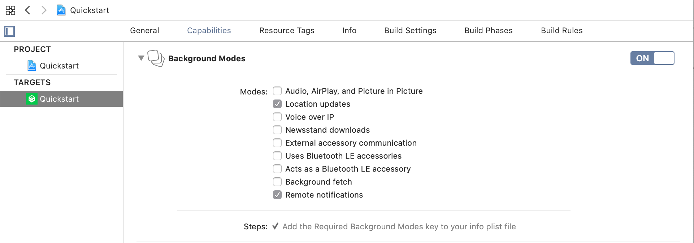
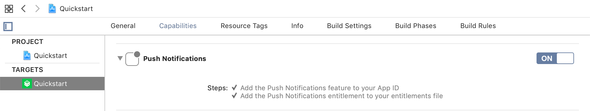

# HyperTrack Quickstart for iOS SDK


[](https://cocoapods.org/pods/HyperTrack)

[HyperTrack](https://www.hypertrack.com) lets you add live location tracking to your mobile app. Live location is made available along with ongoing activity, tracking controls and tracking outage with reasons. This repo contains an example iOS app that has everything you need to get started in minutes.

* [Publishable Key](#publishable-key)–Sign up and get your keys
* [Quickstart](#quickstart-app)–Start with a ready-to-go app with reliable background service
* [Integrate the SDK](#integrate-the-sdk)–Integrate the SDK into your app
* [Dashboard](#dashboard)–See live location of all your devices on your HyperTrack dashboard
* [FAQs](#frequently-asked-questions)–Frequently asked questions
* [Support](#support)–Support

## Publishable Key

We use Publishable Key to identify your devices. To get one:
1. Go to the [Signup page](https://dashboard.hypertrack.com/signup). Enter your email address and password.
2. Open the verification link sent to your email.
3. Open the [Setup page](https://dashboard.hypertrack.com/setup), where you can copy your Publishable Key.


Next, you can [start with the Quickstart app](#quickstart-app), or can [integrate the SDK](#integrate-the-sdk) in your app.

## Quickstart app

1. [Clone this repo](#step-1-clone-this-repo)
2. [Install the SDK dependency](#step-2-install-the-sdk-dependency)
3. [Set your Publishable Key](#step-3-set-your-publishable-key)
4. [Run the Quickstart app](#step-4-run-the-quickstart-app)

### Step 1: Clone this repo
```bash
git clone https://github.com/hypertrack/quickstart-ios.git
cd quickstart-ios
```
### Step 2: Install the SDK dependency

Quickstart app uses [CocoaPods](https://cocoapods.org) dependency manager to install the latest version of the SDK. Using the latest version is advised.

If you don't have CocoaPods, [install it first](https://guides.cocoapods.org/using/getting-started.html#installation).

Run `pod install` inside the cloned directory. After CocoaPods creates the `Quickstart.xcworkspace` workspace file, open it with Xcode.

### Step 3: Set your Publishable Key

Open the Quickstart project inside the workspace and set your [Publishable Key](#publishable-key) inside the placeholder in the `AppDelegate.swift` file.

### Step 4: Run the Quickstart app

Run the app on your phone and you should see the following control interface:


After enabling location and activity permissions (choose "Always Allow" if you want the app to collect location data in the background), SDK starts collecting location and activity data. You can start or stop tracking with the button below.

Check out the [dashboard](#dashboard) to see the live location of your devices on the map.

## Integrate the SDK

### Requirements

HyperTrack SDK supports iOS 11 and above, using Swift or Objective-C.

### Step by step instructions

1. [Add HyperTrack SDK to your Podfile](#step-1-add-hypertrack-sdk-to-your-podfile)
2. [Enable background location updates](#step-2-enable-background-location-updates)
3. [Add purpose strings](#step-3-add-purpose-strings)
4. [Initialize the SDK](#step-4-initialize-the-sdk)
5. [Enable remote notifications](#step-5-enable-remote-notifications)
6. [(optional) Start and stop tracking manually](#step-6-optional-start-and-stop-tracking-manually)
7. [(optional) Identify devices](#step-7-optional-identify-devices)
8. [(optional) Create trip](#step-8-optional-create-trip)
9. [(optional) Set trip markers](#step-9-optional-set-a-trip-marker)


#### Step 1. Add HyperTrack SDK to your Podfile

We use [CocoaPods](https://cocoapods.org) to distribute the SDK, you can [install it here](https://guides.cocoapods.org/using/getting-started.html#installation).

Using command line run `pod init` in your project directory to create a Podfile. Put the following code (changing target placeholder to your target name) in the Podfile:

```ruby
platform :ios, '11.0'
inhibit_all_warnings!

target '<Your app name>' do
  use_frameworks!
  pod 'HyperTrack'
end

post_install do |installer|
  installer.pods_project.targets.each do |target|
    if ['GRDB.swift', 'CocoaLumberjack'].include? target.name
      target.build_configurations.each do |config|
        config.build_settings['SWIFT_VERSION'] = '4.2'
      end
    end
  end
end
```

Run `pod install`. CocoaPods will build the dependencies and create a workspace (`.xcworkspace`) for you.

If your project uses Objective-C only, you need to configure `SWIFT_VERSION` in your project's Build Settings. Alternatively, you can create an empty Swift file, and Xcode will create this setting for you.

#### Step 2. Enable background location updates

Enable Background Modes in your project target's Capabilities tab. Choose "Location updates".


#### Step 3. Add purpose strings

Set the following purpose strings in the `Info.plist` file:


You can ask for "When In Use" permission only, but be advised that the device will see a blue bar at the top while your app is running.


Be advised, purpose strings are mandatory, and the app crashes without them.

#### Step 4. Initialize the SDK

Put the initialization call inside your `AppDelegate`'s `application:didFinishLaunchingWithOptions:` method:

##### Swift

```swift
HyperTrack.publishableKey = "<#Paste your Publishable Key here#>"
```

##### Objective-C

Import the SDK:

```objc
@import HyperTrack;
```

Initialize the SDK:

```objc
HTSDK.publishableKey:@"<#Paste your Publishable Key here#>";
```

##### NSNotifications

Critical error notification is called if the SDK encounters a critical error that prevents it from running. This includes:
  - Initialization errors, like denied Location or Motion permissions (`.permissionDenied`)
  - Authorization errors from the server. If the trial period ends and there is no credit card tied to the account, this is the error that will be called (`.authorizationError`)
  - Incorrectly typed Publishable Key (`.invalidPublishableKey`)
  - General errors. Please contact support if you encounter those (`.generalError`)


###### Swift

```swift
...
/// Inside didFinishLaunchingWithOptions or other place where SDK is initialized
NotificationCenter.default.addObserver(
        self,
        selector: #selector(self.reactToCriticalError(_:)),
        name: Notification.Name.HyperTrackDidEncounterCriticalError,
        object: nil)
...

@objc func reactToCriticalError(_ notification: NSNotification) {
    let hyperTrackError = notification.hyperTrackError()
    /// Handle errors here
}
```

###### Objective-C

```objc
...
/// Inside didFinishLaunchingWithOptions or other place where SDK is initialized
[[NSNotificationCenter defaultCenter] addObserver:self
                                         selector:@selector(reactToCriticalError:)
                                             name:HyperTrackDidEncounterCriticalErrorNotification
                                           object:nil];
...

- (void)reactToCriticalError:(NSNotification *)notification {
    HTSDKCriticalError *criticalError = criticalErrorNotification.HTSDKError;
    /// Handle errors here
}
```

You can also observe when SDK starts and stops tracking and update the UI:

###### Swift

```swift
NotificationCenter.default.addObserver(
    self,
    selector: #selector(trackingStarted),
    name: NSNotification.Name.HyperTrackStartedTracking,
    object: nil)

NotificationCenter.default.addObserver(
    self,
    selector: #selector(trackingStopped),
    name: NSNotification.Name.HyperTrackStoppedTracking,
    object: nil)
```

###### Objective-C

```objc
[[NSNotificationCenter defaultCenter] addObserver:self
                                         selector:@selector(trackingStarted)
                                             name:HyperTrackStartedTrackingNotification
                                           object:nil];

[[NSNotificationCenter defaultCenter] addObserver:self
                                         selector:@selector(trackingStopped)
                                             name:HyperTrackStoppedTrackingNotification
                                           object:nil];
```

#### Step 5. Enable remote notifications

The SDK has a bi-directional communication model with the server. This enables the SDK to run on a variable frequency model, which balances the fine trade-off between low latency tracking and battery efficiency, and improves robustness. For this purpose, the iOS SDK uses APNs silent remote notifications.

> This guide assumes you have configured APNs in your application. If you haven't, read the [iOS documentation on APNs](https://developer.apple.com/documentation/usernotifications/registering_your_app_with_apns).

##### Configure APNs on the dashboard

Log into the HyperTrack dashboard, and open the [setup page](https://dashboard.hypertrack.com/setup). Upload your Auth Key (file in the format `AuthKey_KEYID.p8`) and fill in your Team ID.

This key will only be used to send remote push notifications to your apps.

##### Enable remote notifications in the app

In the app capabilities, ensure that **remote notifications** inside background modes is enabled.



In the same tab, ensure that **push notifications** is enabled.



##### Registering and receiving notifications

The following changes inside AppDelegate will register the SDK for push notifications and route HyperTrack notifications to the SDK.

###### Register for notifications

Inside `didFinishLaunchingWithOptions`, use the SDK method to register for notifications.

**Swift**

```swift
func application(_ application: UIApplication, didFinishLaunchingWithOptions launchOptions: [UIApplication.LaunchOptionsKey: Any]?) -> Bool {
    HyperTrack.registerForRemoteNotifications()
    return true
}
```

**Objective-C**

```objc
- (BOOL)application:(UIApplication *)application didFinishLaunchingWithOptions:(NSDictionary *)launchOptions {
    [HTSDK registerForRemoteNotifications];
    return YES;
}
```

###### Register device token

Inside and `didRegisterForRemoteNotificationsWithDeviceToken` and `didFailToRegisterForRemoteNotificationsWithError` methods, add the relevant lines so that HyperTrack can register the device token.

**Swift**

```swift
func application(_ application: UIApplication, didRegisterForRemoteNotificationsWithDeviceToken deviceToken: Data) {
    HyperTrack.didRegisterForRemoteNotificationsWithDeviceToken(deviceToken)
}

func application(_ application: UIApplication, didFailToRegisterForRemoteNotificationsWithError error: Error) {
    HyperTrack.didFailToRegisterForRemoteNotificationsWithError(error)
}
```

**Objective-C**

```objc
- (void)application:(UIApplication *)application didRegisterForRemoteNotificationsWithDeviceToken:(NSData *)deviceToken {
    [HTSDK didRegisterForRemoteNotificationsWithDeviceToken:deviceToken];
}

- (void)application:(UIApplication *)application didFailToRegisterForRemoteNotificationsWithError:(NSError *)error {
    [HTSDK didFailToRegisterForRemoteNotificationsWithError:error];
}
```

###### Receive notifications

Inside the `didReceiveRemoteNotification` method, add the HyperTrack receiver. This method parses only the notifications sent from HyperTrack.

**Swift**

```swift
func application(_ application: UIApplication, didReceiveRemoteNotification userInfo: [AnyHashable : Any], fetchCompletionHandler completionHandler: @escaping (UIBackgroundFetchResult) -> Void) {
    HyperTrack.didReceiveRemoteNotification(userInfo, fetchCompletionHandler: completionHandler)
}
```

**Objective-C**

```objc
- (void)application:(UIApplication *)application didReceiveRemoteNotification:(NSDictionary *)userInfo fetchCompletionHandler:(void (^)(UIBackgroundFetchResult))completionHandler {
    [HTSDK didReceiveRemoteNotification:userInfo fetchCompletionHandler:completionHandler];
}
```

If you want to make sure to only pass HyperTrack notifications to the SDK, you can use the "hypertrack" key:

**Swift**

```swift
func application(_ application: UIApplication, didReceiveRemoteNotification userInfo: [AnyHashable : Any], fetchCompletionHandler completionHandler: @escaping (UIBackgroundFetchResult) -> Void) {
    if userInfo["hypertrack"] != nil {
        // This is HyperTrack's notification
        HyperTrack.didReceiveRemoteNotification(userInfo, fetchCompletionHandler: completionHandler)
    } else {
        // Handle your server's notification here
    }
}
```

**Objective-C**

```objc
- (void)application:(UIApplication *)application didReceiveRemoteNotification:(NSDictionary *)userInfo fetchCompletionHandler:(void (^)(UIBackgroundFetchResult))completionHandler {
    if (userInfo[@"hypertrack"] != nil) {
        // This is HyperTrack's notification
        [HTSDK didReceiveRemoteNotification:userInfo fetchCompletionHandler:completionHandler];
    } else {
        // Handle your server's notification here
    }
}

```

#### Step 6. (optional) Start and stop tracking manually

You can start and stop tracking manually. When you start tracking you can control if HyperTrack should request the appropriate Location and Motion permissions on your behalf.

##### Swift

```swift
/// Start tracking
HyperTrack.startTracking()

/// Stop tracking
HyperTrack.stopTracking()
```

##### Objective-C

```objc
/// Start tracking
[HTSDK startTracking];

/// Stop tracking
[HTSDK stopTracking];
```

#### Step 7. (optional) Identify devices
All devices tracked on HyperTrack are uniquely identified using [UUID](https://en.wikipedia.org/wiki/Universally_unique_identifier). You can get this identifier programmatically in your app by calling `getDeviceId` after initialization.
Another approach is to tag device with a name that will make it easy to distinguish them on HyperTrack Dashboard.

##### Swift

```swift
HyperTrack.deviceName = "Device name"
```

##### Objective-C

```objc
HTSDK.deviceName = @"Device name";
```

#### Step 8. (optional) Create trip


Create trips to track the device journey going from one place to another. Most of the time, you are not only interested in the latest location but a set of location-related data. For example how long you should expect someone to arrive, what distance someone traveled during his working day etc.
For such cases, you can scope location data at the required level of granularity by creating a trip, through submitting a request like below to HyperTrack backend.

You can use the node sample request below or create one yourself using [API Reference](https://docs.hypertrack.com/#references-apis-trips-post-trips)
<details>

```Javascript

const request = require('request');
// deviceId is obtained from the previous step
const deviceId = "DEVICE_ID_HERE";
// get two strings below from https://dashboard.hypertrack.com/setup
const accountId = 'ACCOUNT_ID';
const secretKey = 'SECRET_KEY';

const trip ={
  "device_id": deviceId,
  "destination": {
    "geometry": { "type": "Point", "coordinates": [-115.122993, 36.089361] }
  },
  "geofences": [
    {
      "geometry": { "type": "Point", "coordinates": [-115.1768575, 36.0949879] },
      "metadata": { "building": "Luxor" }
    }
  ],
  "metadata": {"destination": "Paradise"}
};

const options = {
    "uri": "https://v3.api.hypertrack.com/trips/",
    "auth": {'user': accountId, 'pass': secretKey},
    "json": trip
};

request.post(options, function (error, response, body) {
  if (error) {
    return console.error('Trip creation failed:', error);
  }
  console.log('Server responded with:', response.statusCode);
  if (response.statusCode == 201) {
    console.log('Successfully created trip', body);
  }
});

```

</details>

You'll receive a response with the trip object inside. Trip object [contains lots useful fields](https://docs.hypertrack.com/#references-apis-trips-get-trips-trip_id) but let's take a look at `views.embed_url` value, that contains a reference to trip details web view like below


After the trip has ended, you can access its aggregate data (entire route, time, etc.). You can review the trip using the replay feature in the web view mentioned above.


#### Step 9. (optional) Set a trip marker

Use this optional method if you want to tag the tracked data with trip markers that happen in your app. E.g. user marking a task as done, user tapping a button to share location, user accepting an assigned job, device entering a geofence, etc.

The SDK supports sending trip marker data that can be converted to JSON from a `Dictionary` type.

##### Swift

```swift
HyperTrackMetadata.makeMetadata(["trip keys": "trip values"], success: { (metadata) in
    HyperTrack.setTripMarker(metadata)
}) { (error) in
    // Handle errors
}
```

##### Objective-C

```objc
[HTSDKMetadata makeMetadata:@{@"trip keys": @"trip values"} success:^(HTSDKMetadata * _Nonnull metadata) {
    [HTSDK setTripMarker:metadata];
} failure:^(HTSDKMetadataError * _Nonnull error) {
    // Handle errors
}];
```

#### You are all set

You can now run the app and start using HyperTrack. You can see your devices on the [dashboard](#dashboard).

## Dashboard

Once your app is running, go to the [dashboard](https://dashboard.hypertrack.com/devices) where you can see a list of all your devices and their live location with ongoing activity on the map.


## Frequently Asked Questions
- [Error: Access to Activity services has not been authorized](#error-access-to-activity-services-has-not-been-authorized)


#### Error: Access to Activity services has not been authorized
You are running the quickstart app on the iOS simulator, which currently does not support CoreMotion services. You can test the quickstart app on real iOS devices only.

## Support
Join our [Slack community](http://slack.hypertrack.com) for instant responses. You can also email us at help@hypertrack.com.
