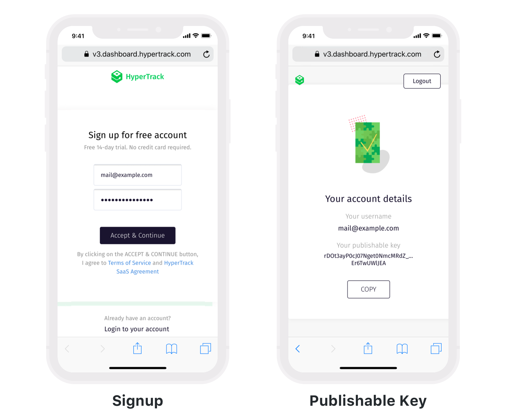
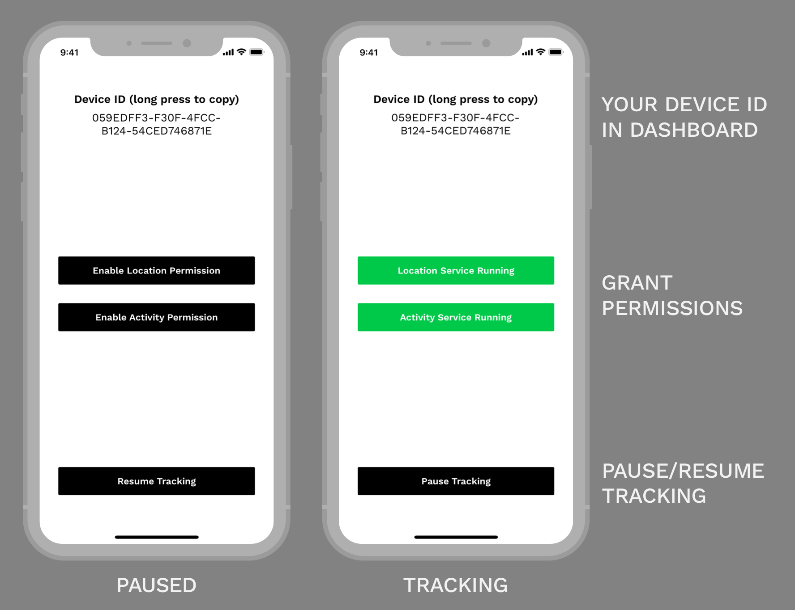
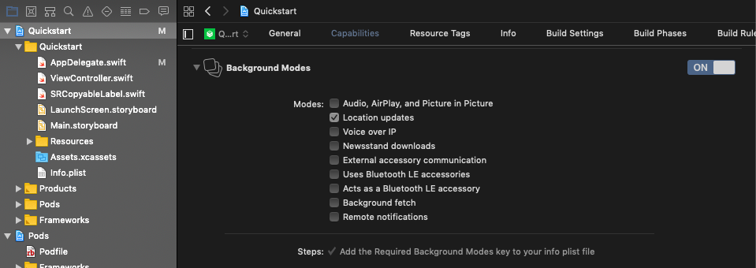
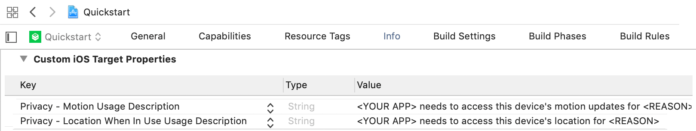
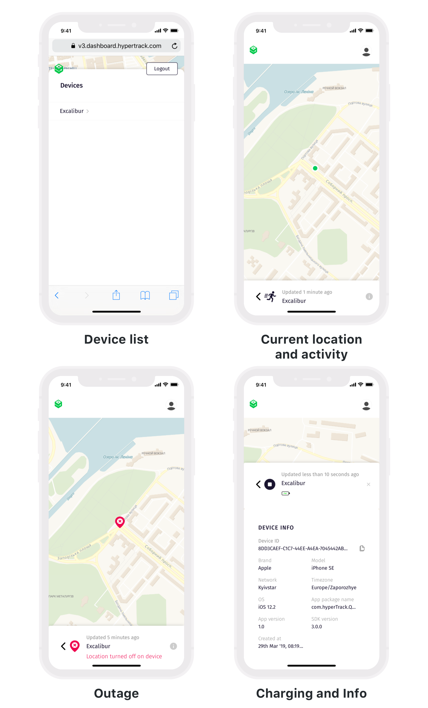

# HyperTrack Quickstart for iOS SDK


[HyperTrack](https://www.hypertrack.com) lets you add live location tracking to your mobile app. Live location is made available along with ongoing activity, tracking controls and tracking outage with reasons. This repo contains an example iOS app that has everything you need to get started in minutes.

* [Publishable Key](#publishable-key)–Sign up and get your keys
* [Quickstart](#quickstart-app)–Start with a ready-to-go app with reliable background service
* [Integrate the SDK](#integrate-the-sdk)–Integrate the SDK into your app
* [Dashboard](#dashboard)–See live location of all your devices on your HyperTrack dashboard

## Publishable Key

We use Publishable Key to identify your devices. To get one:
1. Go to the [Signup page](https://v3.dashboard.hypertrack.com/signup). Enter your email address and password.
2. Open the verification link sent to your email.
3. Open the [Keys page](https://v3.dashboard.hypertrack.com/account/keys), where you can copy your Publishable Key.



Next, you can [start with the Quickstart app](#quickstart-app), or can [integrate the SDK](#integrate-the-sdk) in your app.

## Quickstart app

1. [Clone this repo](#step-1-clone-this-repo)
2. [Install the SDK dependency](#step-2-install-the-sdk-dependency)
3. [Set your Publishable Key](#step-3-set-your-publishable-key)
4. [Run the Quickstart app](#step-4-run-the-quickstart-app)

### Step 1: Clone this repo
```bash
git clone https://github.com/hypertrack/quickstart-ios.git
cd quickstart-ios
```
### Step 2: Install the SDK dependency

Quickstart app uses [CocoaPods](https://cocoapods.org) dependency manager to install the latest version of the SDK. Using the latest version is advised.

If you don't have CocoaPods, [install it first](https://guides.cocoapods.org/using/getting-started.html#installation).

Run `pod install` inside the cloned directory. After CocoaPods creates the `Quickstart.xcworkspace` workspace file, open it with Xcode.

### Step 3: Set your Publishable Key

Open the Quickstart project inside the workspace and set your [Publishable Key](#publishable-key) inside the placeholder in the `AppDelegate.swift` file.

### Step 4: Run the Quickstart app

Run the app on your phone and you should see the following control interface:



After enabling location and activity permissions (choose "Always Allow" if you want the app to collect location data in the background), SDK starts collecting location and activity data. You can pause or resume the tracking with the button below.

Check out the [dashboard](#dashboard) to see the live location of your devices on the map.

## Integrate the SDK

### Requirements

HyperTrack SDK supports iOS 9 and above, using Swift or Objective-C.

### Step by step instructions

1. [Add HyperTrack SDK to your Podfile](#step-1-add-hypertrack-sdk-to-your-podfile)
2. [Enable background location updates](#step-2-enable-background-location-updates)
3. [Add purpose strings](#step-3-add-purpose-strings)
4. [Initialize the SDK](#step-4-initialize-the-sdk)
5. [Ask the user for permissions](#step-5-ask-the-user-for-permissions)
5. [Identify devices](#step-6-optional-identify-devices)


#### Step 1: Add HyperTrack SDK to your Podfile

We use [CocoaPods](https://cocoapods.org) to distribute the SDK, you can [install it here](https://guides.cocoapods.org/using/getting-started.html#installation).

Using command line run `pod init` in your project directory to create a Podfile. Put `pod 'HyperTrack'` in the Podfile:

```ruby
platform :ios, '9.0'
inhibit_all_warnings!

target '<Your app name>' do
  use_frameworks!
  pod 'HyperTrack'
end
```

Run `pod install`. CocoaPods will build the dependencies and create a workspace (`.xcworkspace`) for you.

If your project uses Objective-C only, you need to configure `SWIFT_VERSION` in your project's Build Settings. Set the version to `4.2`. Alternatively, you can create an empty Swift file, and Xcode will create this setting for you. Don't forget to set it to `4.2`. Additionally, after running `pod install`, make sure that the same setting is present in `CocoaLumberjack` and `GRDB.swift` target inside the `Pods` project.

#### Step 2: Enable background location updates

Enable Background Modes in your project target's Capabilities tab. Choose "Location updates".



#### Step 3: Add purpose strings

Set the following purpose strings in the `Info.plist` file:


Include `Privacy - Location Always Usage Description` key only when you need iOS 10 compatibility.

You can ask for "When In Use" permission only, but be advised that the device will see a blue bar at the top while your app is running.



Be advised, purpose strings are mandatory, and the app crashes without them.

#### Step 4: Initialize the SDK

Put the initialization code inside your `AppDelegate`'s `application:didFinishLaunchingWithOptions:` method

##### Swift

```swift
HyperTrack.initialize(publishableKey: "<#Paste your Publishable Key here#>") { (error) in
    /// perform post initialization actions
    /// handle errors if any
}
```

##### Objective-C

Import the SDK:

```objc
@import HyperTrack;
```

Initialize the SDK:

```objc
[HTSDK initializeWithPublishableKey:@"<#Paste your Publishable Key here#>" completionHandler:^(HTSDKError * _Nullable error) {
    /// perform post initialization actions
    /// handle errors if any
}];
```

#### Step 5: Ask the user for permissions

In your app, use our convenience functions to ask for the location and activity permissions. HyperTrack SDK needs both to generate accurate and enriched location data.

##### Swift

```swift
HyperTrack.requestLocationPermission { (error) in
    /// handle errors if any
}

HyperTrack.requestActivityPermission { (error) in
    /// handle errors if any
}
```

##### Objective-C

```objc
[HTSDK requestLocationPermissionWithCompletionHandler:^(HTSDKError * _Nullable error) {
    /// handle errors if any
}];

[HTSDK requestActivityPermissionWithCompletionHandler:^(HTSDKError * _Nullable error) {
    /// handle errors if any
}];
```

#### Step 6. (optional) Identify devices
All devices tracked on HyperTrack are uniquely identified using [UUID](https://en.wikipedia.org/wiki/Universally_unique_identifier). You can get this identifier programmatically in your app by calling `getDeviceId` after initialization.
Another approach is to tag device with a name that will make it easy to distinguish them on HyperTrack Dashboard.

##### Swift

```swift
HyperTrack.setDevice(name: "Device name", metaData: [String: Any](), { (error) in 
  /// handle errors if any
});
```

##### Objective-C

```objc
[HTSDK setDeviceForName: "Device name" metaData: nil completionHandler:^(HTSDKError * _Nullable error) {
    /// handle errors if any
}];
```

#### You are all set

You can now run the app and start using HyperTrack. You can see your devices on the [dashboard](#dashboard).

## Dashboard

Once your app is running, go to the [dashboard](https://v3.dashboard.hypertrack.com/devices) where you can see a list of all your devices and their live location with ongoing activity on the map.


