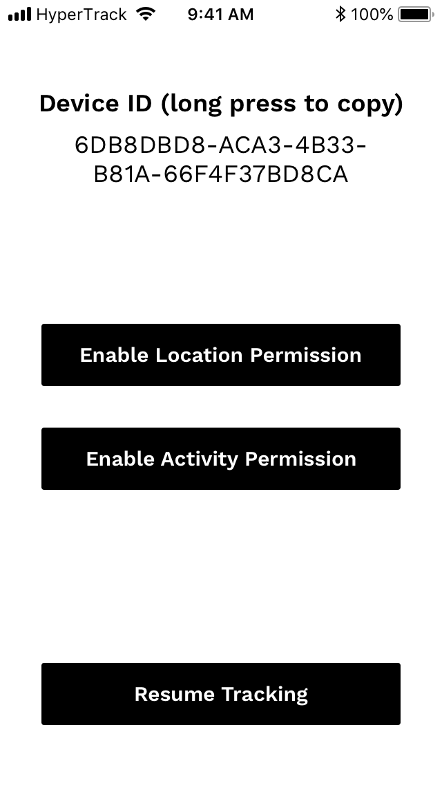
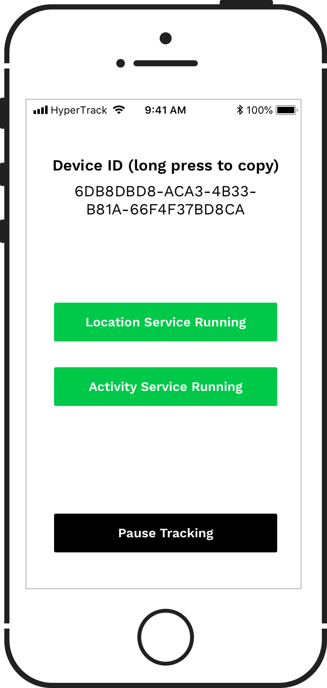

# HyperTrack SDK Quickstart for iOS


[HyperTrack](https://www.hypertrack.com) lets you add live location tracking to your mobile app. This repo contains an example client app that has everything you need to get started in minutes.

First, you need Publishable Key so that we can identify your devices. You can get it [here]().
Then you can [start with this Quickstart app](#starting-with-quickstart-app) that is ready to go or you can [integrate the SDK](#integrating-the-SDK-in-your-app) in your app.

## Starting with Quickstart app

### Clone this repo
```bash
git clone https://github.com/hypertrack/quickstart-ios.git
cd quickstart-ios
```
### Install the SDK dependency

Quickstart app uses CocoaPods dependency manager to install the latest version of the SDK.

If you don't have CocoaPods, [install it first](https://guides.cocoapods.org/using/getting-started.html#installation).

Run `pod install` inside the cloned directory. After CocoaPods creates the `Quickstart.xcworkspace` workspace file, open it with Xcode.

### Set your Publishable Key

Open the Quickstart project inside the workspace. Set your Publishable Key inside the placeholder in `AppDelegate.swift` file.

### You are all set

Run the app on your phone, and you should see the following control interface:



After enabling location and activity permissions (choose "Always Allow" if you want the app to collect location data in the background), SDK starts collecting location data.



## Integrating the SDK in your app

### Requirements

HyperTrack SDK supports iOS 9 and above, using Swift or Objective-C. 

### Step by step instructions

#### Add HyperTrackCore SDK to your Podfile

```ruby
platform :ios, '9.0'
inhibit_all_warnings!

target '<#Your app name#>' do
  use_frameworks!
  pod 'HyperTrackCore', :git => 'https://github.com/hypertrack/core-ios-sdk.git', :commit => 'c7554a7e9664b4c0c58de0c635ade83683bb0b3b'
end

# This pre-install script is needed to set the SDK dependencies to use Swift 4.0
pre_install do |installer|
  installer.analysis_result.specifications.each do |s|
    s.swift_version = '4.0' unless s.swift_version
  end
end
```

#### Enable background location updates

Enable Background Modes in your project target's Capabilities tab. Choose "Location updates."


Open the Info tab and set the privacy permission strings. They show up in permission alerts for the user. You need to add:
- NSLocationAlwaysAndWhenInUseUsageDescription
- NSLocationWhenInUseUsageDescription
- NSMotionUsageDescription
- NSLocationAlwaysUsageDescription (if you are targeting versions before iOS 11)

In your app, use our convenience functions to ask for the location and activity permissions.

```swift
HyperTrackCore.requestLocationPermission { (error) in
    /// handle errors if any
}

HyperTrackCore.requestActivityPermission { (error) in
    /// handle errors if any
}
```

```objc
[HTCore requestLocationPermissionWithCompletionHandler:^(HTCoreError * _Nullable error) {
    /// handle errors if any
}];

[HTCore requestActivityPermissionWithCompletionHandler:^(HTCoreError * _Nullable error) {
    /// handle errors if any
}];
```

#### Initialize the SDK

Put the initialization code inside your AppDelegate's `application:didFinishLaunchingWithOptions:` method 

```swift
HyperTrackCore.initialize(publishableKey: "<#Paste your Publishable Key here#>") { (error) in
    /// perform post initialization actions
    /// handle errors if any
}
```

```objc
[HTCore initializeWithPublishableKey:@"<#Paste your Publishable Key here#>" completionHandler:^(HTCoreError * _Nullable error) {
    /// perform post initialization actions
    /// handle errors if any
}];
```

#### You are all set

You can run the app and start using HyperTrack.
